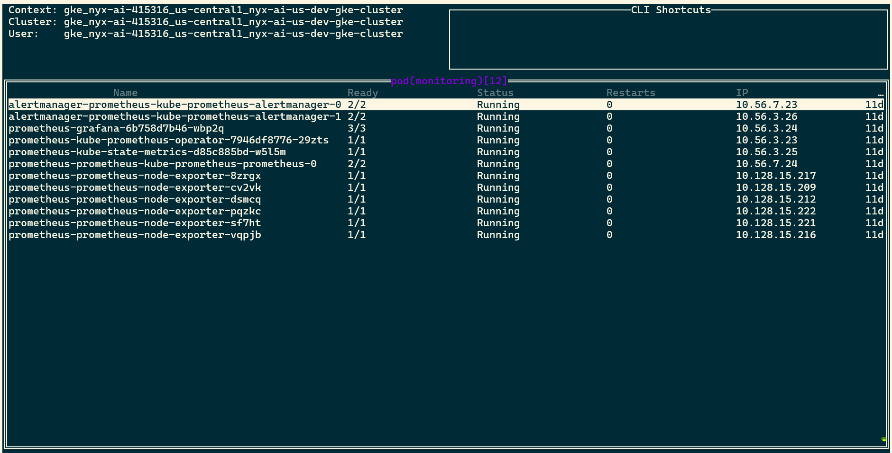
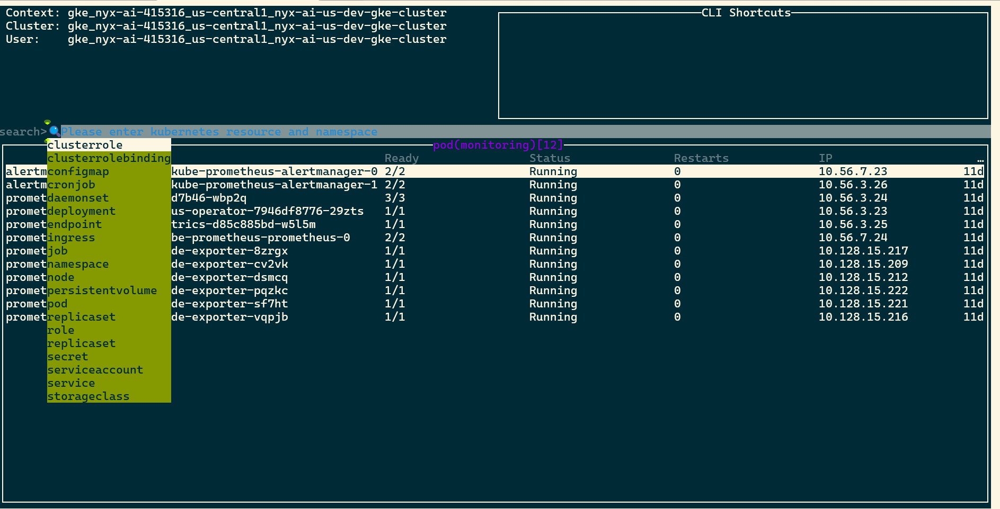
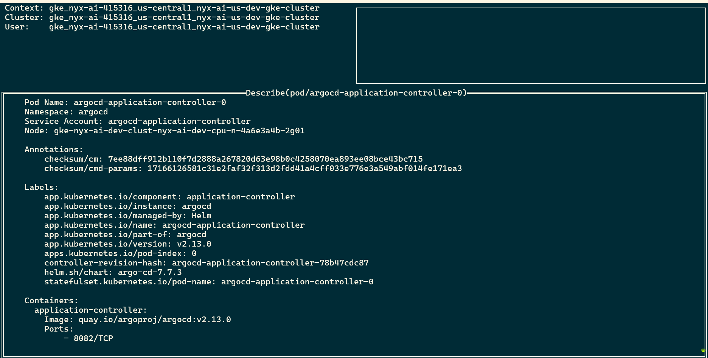
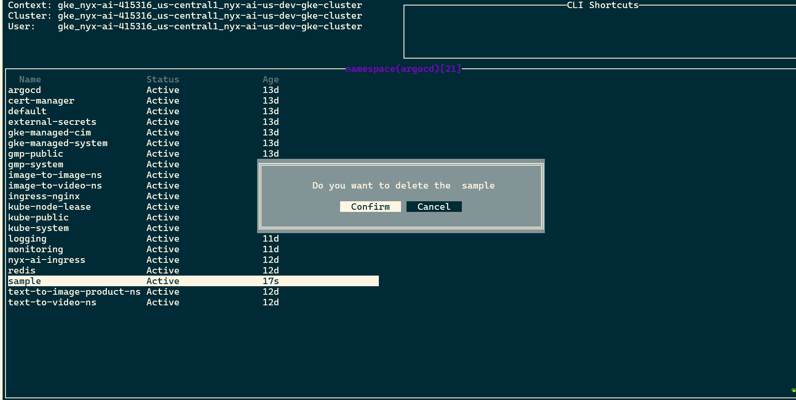

# kubedash
[](https://github.com/Gkemhcs/kubedash/actions/workflows/release.yaml)

**kubedash** is a terminal-based Kubernetes dashboard that provides a simple and interactive way to manage Kubernetes resources directly from the command line. It allows you to list, search, describe, and delete resources with ease. Built with Go using the `tview`, `cobra`, and `logrus` libraries, kubedash offers a clean, user-friendly terminal interface for Kubernetes management.

## Features

- **List Resources**: Quickly list Kubernetes resources such as Pods, Deployments, ReplicaSets, and more.
- **Search Resources**: Easily search for resources across your clusters using simple queries.
- **Describe Resources**: View detailed information about a resource to better understand its configuration and status.
- **Delete Resources**: Delete Kubernetes resources from the command line with simple actions.
- **Customizable**: Configure the tool to suit your preferences with simple flags and settings.

## Prerequisites

- **Go**: kubedash is built using Go 1.18+.
- **Kubernetes Cluster**: You need access to a running Kubernetes cluster (local or remote) with valid `kubectl` credentials.
- **Libraries**: This tool relies on the following Go libraries:
  - `tview`: For the terminal UI.
  - `cobra`: For command-line argument parsing and creating commands.
  - `logrus`: For structured logging.

## Demo Video
[🎥videolink🎥]("https://drive.google.com/file/d/1Mi8OSCNpTuJ_DfJIvd4O5X7vRrDssTcZ/view?usp=sharing") 


## Images 
**Home layout**


**Search Option**


**Describe Option**


**Delete Option**



## Installation

To install **kubedash**, follow these steps:

### Method 1: Build from Source

1. Clone the repository:

   ```bash
   git clone https://github.com/Gkemhcs/kubedash.git
   cd kubedash
### Method 2:  using `go install`
```bash
go install github.com/Gkemhcs/kubedash@latest
```
### Method 3:  Download from Github Releases


1. Visit the [Releases Page](https://github.com/Gkemhcs/kubedash/releases) and download the appropriate binary for your operating system:
   - **Linux**: `kubedash-linux-amd64`
   - **macOS**: `kubedash-darwin-amd64`
   - **Windows**: `kubedash-windows-amd64.exe`

2. Make the binary executable (for Linux/macOS):

   ```bash
   chmod +x kubedash-linux-amd64
   sudo mv kubedash-linux-amd64 /usr/local/bin/kubedash
   ```
3. On Windows, add the binary location to your system PATH or run it directly

Here’s the full README.md content in code form:

# kubedash

**kubedash** is a terminal-based Kubernetes dashboard that provides a simple and interactive way to manage Kubernetes resources directly from the command line. It allows you to list, search, describe, and delete resources with ease. Built with Go using the `tview`, `cobra`, and `logrus` libraries, kubedash offers a clean, user-friendly terminal interface for Kubernetes management.

## Features

- **List Resources**: Quickly list Kubernetes resources such as Pods, Deployments, ReplicaSets, and more.
- **Search Resources**: Easily search for resources across your clusters using simple queries.
- **Describe Resources**: View detailed information about a resource to better understand its configuration and status.
- **Delete Resources**: Delete Kubernetes resources from the command line with simple actions.
- **Customizable**: Configure the tool to suit your preferences with simple flags and settings.

## Prerequisites

- **Go**: kubedash is built using Go 1.18+.
- **Kubernetes Cluster**: You need access to a running Kubernetes cluster (local or remote) with valid `kubectl` credentials.
- **Libraries**: This tool relies on the following Go libraries:
  - `tview`: For the terminal UI.
  - `cobra`: For command-line argument parsing and creating commands.
  - `logrus`: For structured logging.

## Installation

To install **kubedash**, follow these steps:

### Method 1: Build from Source

1. Clone the repository:

   ```bash
   git clone https://github.com/Gkemhcs/kubedash.git
   cd kubedash

    Install dependencies:

go mod tidy

Build the binary:

go build -o kubedash

Move the binary to a directory in your PATH for easier access:

    sudo mv kubedash /usr/local/bin/

Method 2: Using go install

go install github.com/Gkemhcs/kubedash@latest

Usage

Once kubedash is installed, you can run it from the terminal. Here's a brief overview of available commands and flags:
Start kubedash:

kubedash

This will open the interactive dashboard where you can list, search, describe, and delete resources.
Commands:

    List Resources:
    To list resources, use the following commands:

    kubedash list pods
    kubedash list deployments
    kubedash list replicasets

    This will display a table of the requested resource type in the current namespace.

    Search Resources:
    To search for specific resources across your cluster, use the search bar at the top of the terminal interface. You can search by resource name, namespace, or other criteria.

    Describe Resources:
    To view detailed information about a specific resource, navigate to the resource and press d. This will show all available details, including labels, annotations, and resource status.

    Delete Resources:
    To delete a resource, select the resource and press d. This will remove the selected resource from your cluster after confirmation.

    Quit kubedash:
    Press Ctrl+C to quit the dashboard and return to the terminal.

## Running Application 
```bash
# prints the info 
kubedash info 
# prints the version of cli tool
kubedash version 
# start application
kubedash
```
## Keyboard Shortcuts

    Ctrl+s: Start a search query.
    Ctrl+d: Delete the selected resource.
    d: Describe the selected resource.
    Ctrl+c: Quit the kubedash application.
